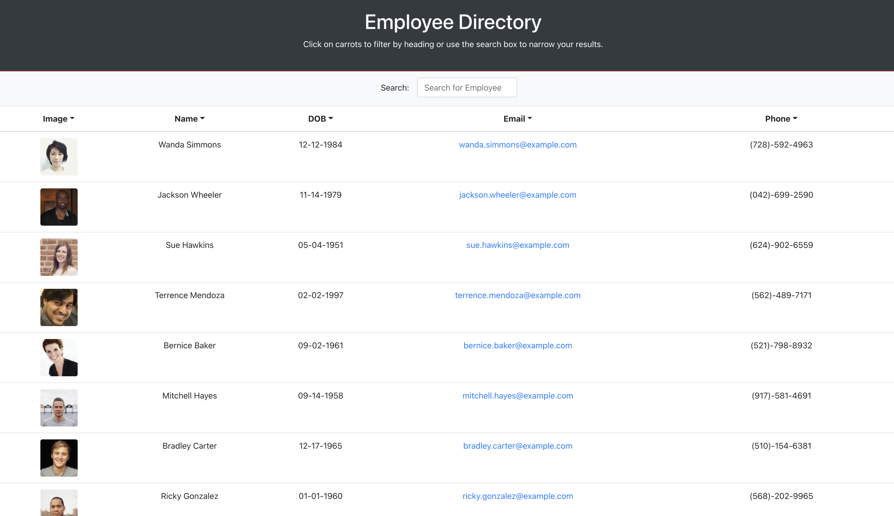
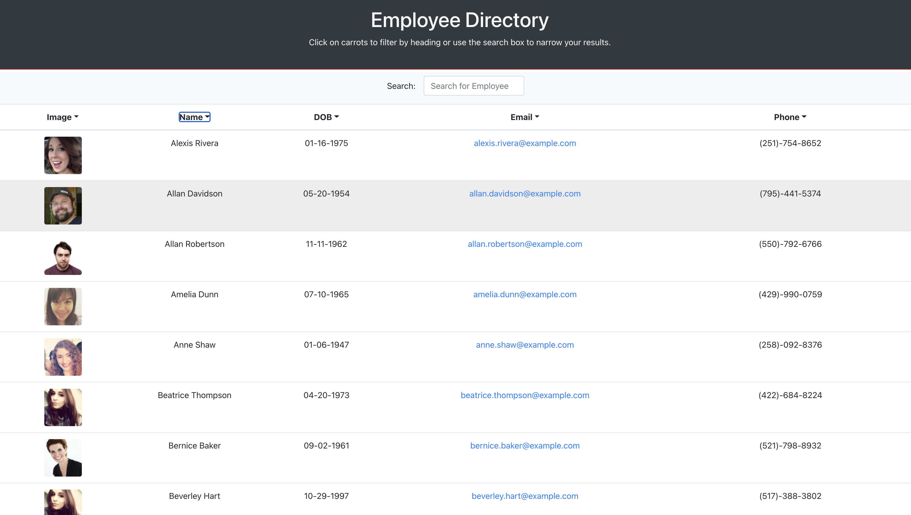
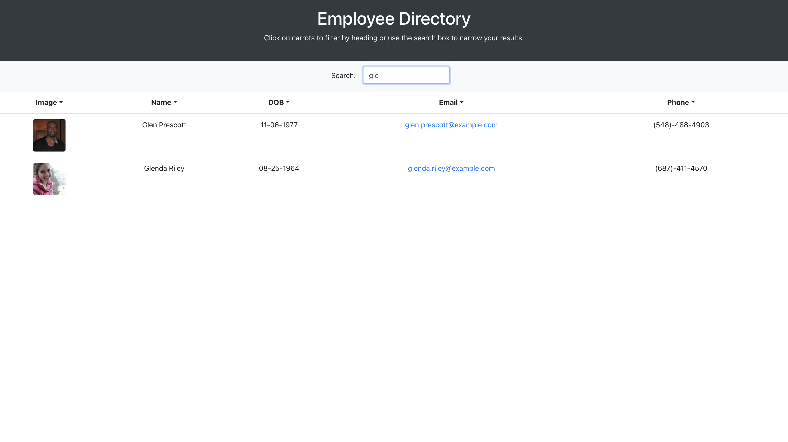

# Employee Directory

  

  ## Description

  The application is an employee directory that displays all the employees on record with a picture, name, date of birth, email, and phone number of each employee . You can sort by name or you can look up an employee by name directly by using the search box.

  ## Table of Contents

  -[Installation](#installation)

  -[Usage](#Usage)

  -[License](#license)

  -[Contributing](#contributing)

  -[Tests](#tests)

  -[Questions](#questions)
  
  -[Demonstration](#demonstration)

  ## Installation

  npm install

  ## Usage

  Just be careful and create your own branch.

  ## License

  This project is licensed under [MIT](https://opensource.org/licenses/MIT) license.

  ## Contributing

  Just be careful.

  ## Tests

  TBD

  ## Questions

  If you have any questions about the repo, open an issue or contact me directly at egomezfax19@mail.com. You can find more of my work at [www.github.com/egome019](https://github.com/egome019)

   ## Demonstration
  
  [Click here](https://egome019.github.io/employeeDirectory-React/) to be directed to the application.
  
  
  Image below shows app sorting alphabetically by name.
  
  
  Image below shows app searching by name.
  
